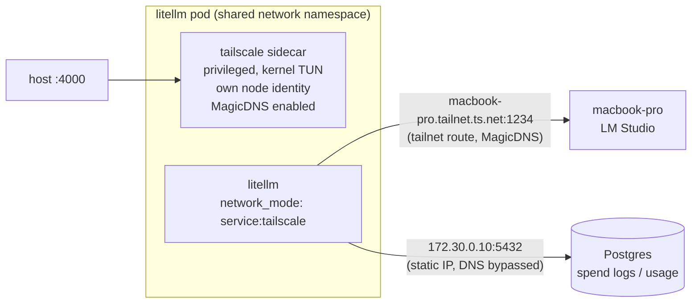

# litellm + tailscale sidecar

## Mission

Get LiteLLM to connect to hosts reachable only over Tailscale, when the
host machine itself is connected to a different VPN that conflicts with
running Tailscale at the OS level. The host's own `tailscale` CLI can stay
`stopped` indefinitely — LiteLLM's Tailscale connectivity lives entirely
inside this compose stack, as an independent tailnet node with its own
identity, unaffected by whatever VPN the host is using.

## Architecture



`litellm` has no network identity of its own — it joins the `tailscale`
container's network namespace (`network_mode: service:tailscale`), so its
outbound calls to the tailnet peer route through the sidecar's kernel-mode
Tailscale interface. This works independently of the host's own `tailscale`
CLI state (can be `stopped` to let another VPN use the host's networking)
since the sidecar is a separate node with its own identity and state
(`./tailscale-state`, authenticated via `.env`'s `TS_AUTHKEY`).

## Why not simpler

- **Kernel TUN, not userspace networking**: Tailscale's default userspace
  mode only proxies *inbound* connections to the sidecar's own tailnet IP;
  it can't route a sibling container's *outbound* dials. Needs
  `TS_USERSPACE: "false"` (not just omitted — it defaults to userspace) and
  `privileged: true` (rootless podman denies `TUNSETIFF` even with
  `cap_add: [net_admin, net_raw]` + a passed-through `/dev/net/tun`).
- **`db` reachable by static IP, not name**: `/etc/resolv.conf` is shared
  between the sidecar and `litellm` (network-config files get bind-mounted
  for `network_mode: service:X`), so enabling MagicDNS (needed to resolve
  `*.ts.net` names) replaces it with Tailscale's `100.100.100.100` resolver,
  which doesn't forward unmatched short names like `db`. `litellm`'s own
  `dns:`/`extra_hosts:` compose directives are ignored under
  `network_mode: service:tailscale` (it doesn't own the network config), so
  `db` is pinned to a static compose-network IP (`172.30.0.10`) and
  referenced directly in `DATABASE_URL` instead.
- **`tailscale up` flags persist** in the state store across restarts —
  toggling `accept-dns` requires an explicit value every time, not just
  removing the flag.

## Files

- `docker-compose.yml` — the stack (`tailscale` sidecar, `litellm`, `db`).
- `config.yaml` — model list; mounted read-only (`:Z` — SELinux needs the
  relabel or the container gets a misleading "config file not found").
- `.env` (gitignored; copy from `.env.example`) — `TS_AUTHKEY` and
  `MACBOOK_PRO_LMSTUDIO_KEY`.

## Operating

```sh
podman-compose up -d
curl -H "Authorization: Bearer sk-1234" http://localhost:4000/v1/models
```

**Never `podman-compose restart litellm` (or `restart tailscale`) alone.**
Restarting only the dependent side of a `network_mode: service:X` pair
desyncs it from the sidecar's live network namespace — the container keeps
running and can even pass its healthcheck, but ends up with an empty route
table (`Network is unreachable` to everything, including `db`). Symptom:
`curl localhost:4000` returns "Connection reset by peer" even though both
containers show `Up`. Always recreate the whole pod together:

```sh
podman-compose down && podman-compose up -d
```

Confirm the fix worked by comparing actual netns identity (not
`podman inspect`'s `SandboxKey`, which can look consistent even when they've
diverged):

```sh
TS_PID=$(podman inspect litellm_tailscale_1 --format '{{.State.Pid}}')
LLM_PID=$(podman inspect litellm_litellm_1 --format '{{.State.Pid}}')
readlink /proc/$TS_PID/ns/net
readlink /proc/$LLM_PID/ns/net   # must match
```

Admin UI (spend, usage, virtual keys) at `http://localhost:4000/ui`.
